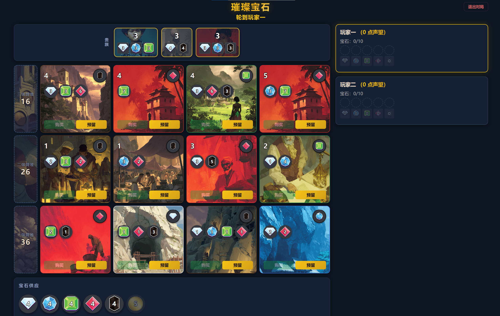

# Splendor （璀璨宝石/宝石商人） 中文双人本地版

基于 [TanmayKhot/splendor](https://github.com/TanmayKhot/splendor) 改造的简体中文浏览器游戏。两名玩家在同一台电脑上轮流操作，无需登录或连接游戏服务器。

🎮 **[打开网页版，直接开始游戏](https://nelonbu.github.io/splendor-zh/)**



## 功能

- 双人同机对局
- 简体中文界面与规则说明
- 发展卡、贵族、宝石及牌背图片
- 购买、预留、拿取宝石、贵族选择与回合撤回
- 卡牌和宝石的移动动画
- 可开关的循环背景音乐

## 本地运行要求

- Node.js 20.19+ 或 22.12+
- npm

## 安装与启动

在项目目录执行：

```bash
npm ci
npm run dev:local
```

打开终端显示的本地地址，通常是 `http://localhost:5173/`。输入两名玩家的姓名即可开始。如果该端口已被占用，以终端显示的地址为准。

Windows 用户安装依赖后，也可以双击 `PlaySplendor.cmd` 启动游戏。游玩期间请保持启动窗口开启；关闭窗口即停止本地服务。

## 检查与构建

```bash
npm run assets:check
npm test
npm run build
```

构建结果位于 `dist/`。素材预览可通过 `npm run assets:preview` 启动。

## 网页版部署

本仓库已通过 GitHub Pages 发布。推送到 `main` 后，`.github/workflows/pages.yml` 会运行素材检查、测试和网页构建，再更新网页版；部署结果可在仓库 **Actions** 的 `Deploy GitHub Pages` 中查看。

Pages 构建使用 `/splendor-zh/` 路径；普通 `npm run build` 和 Windows 双击启动入口仍使用本地根路径。网页允许两人在同一设备上轮流玩，不提供跨设备同步。

## 项目说明

游戏规则数据与状态管理沿用主项目。图片只用于展示；卡牌费用、分数和贵族要求仍来自游戏数据。

项目基于 [TanmayKhot/splendor](https://github.com/TanmayKhot/splendor) 改造。部分图片素材参考并来自 PyGem，素材来源与映射记录见 [ASSETS.md](ASSETS.md)。开发进度及已执行的检查见 [STATUS.md](STATUS.md)。
